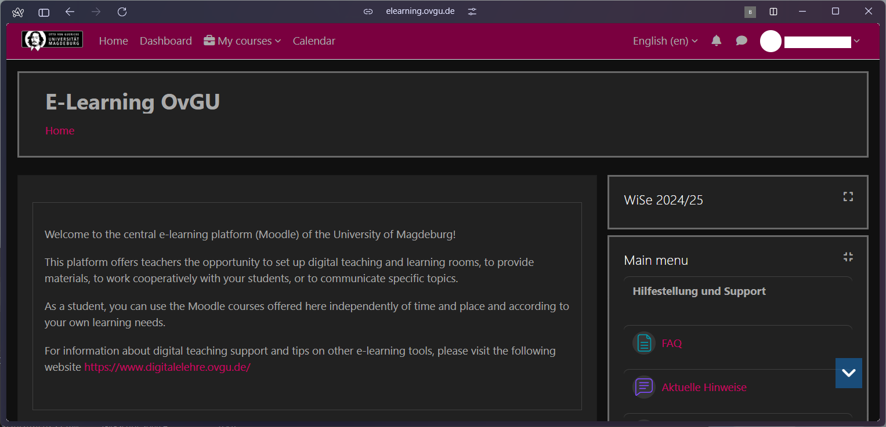

# Better OVGU Moodle

Better OVGU Moodle is a browser extension designed to enhance the user experience of the OVGU eLearning platform. It offers features like dark mode and a custom navigation bar to improve usability and aesthetics.

## ⚠️ Important Notice

**This is a very early version of the extension. Use it at your own risk.**

**CRITICAL: Uninstall this extension before taking any quizzes, exams, or engaging in any activities that will affect you academically on the OVGU eLearning platform.**

## Features

### Dark Mode

Easier on the eyes, especially during night-time study sessions.

Before | After
:-------------------------:|:-------------------------:
 | 

### Custom Navigation Bar

Streamlined navigation for quicker access to important sections.

Before | After
:-------------------------:|:-------------------------:
 | 

## Installation

1. Clone this repository or download the ZIP file.
2. Open your browser's extension page (e.g., `chrome://extensions` for Chrome).
3. Enable "Developer mode".
4. Click "Load unpacked" and select the directory containing the extension files.

## Usage

After installation, you'll see the extension icon in your browser toolbar. Click on it to:

- Toggle Dark Mode on/off
- Enable/disable the Custom Navigation Bar

## Contributing

We welcome contributions and suggestions! If you'd like to contribute:

1. Fork the repository
2. Create your feature branch (`git checkout -b feature/AmazingFeature`)
3. Commit your changes (`git commit -m 'Add some AmazingFeature'`)
4. Push to the branch (`git push origin feature/AmazingFeature`)
5. Open a Pull Request

For major changes or suggestions, please open an issue first to discuss what you would like to change.

## License

This project is licensed under the MIT License.

## Disclaimer

This extension is not officially associated with or endorsed by Otto von Guericke University Magdeburg. Use it at your own discretion.

## Contact

If you have any questions, feel free to open an issue or me.

